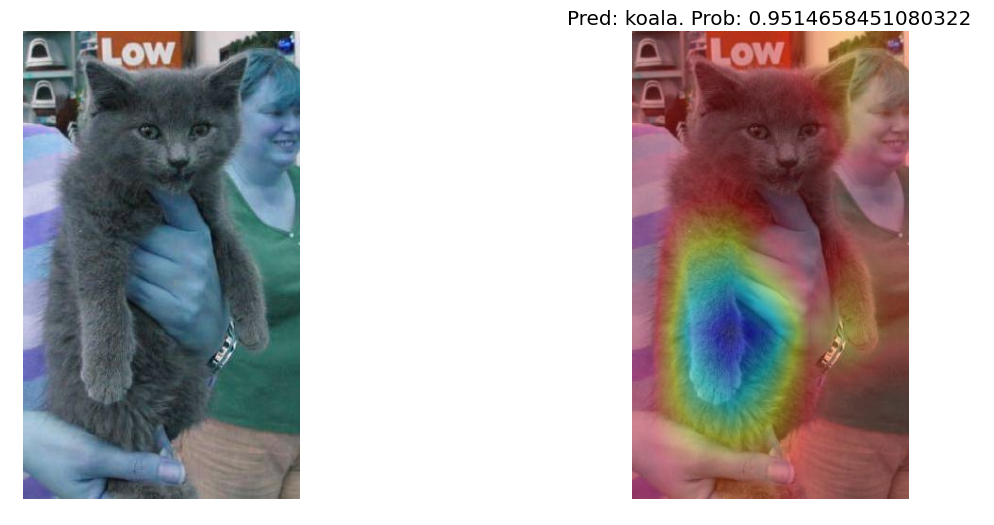
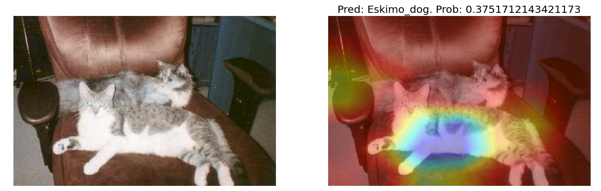
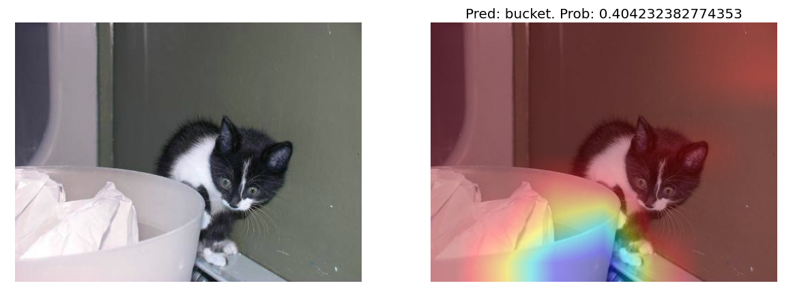
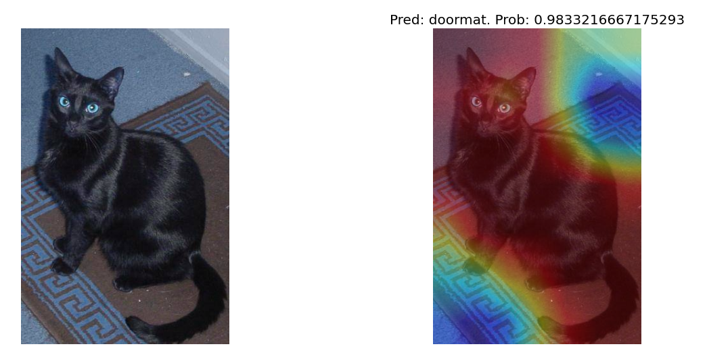
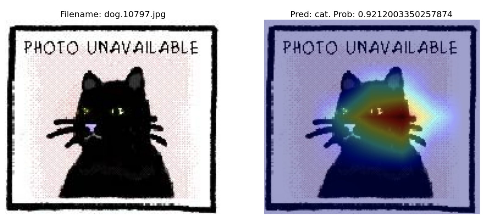

After implementing GradCAM with ResNet50 pre-trained on ImageNet for [Dogs vs Cats](https://www.kaggle.com/c/dogs-vs-cats) data on Kaggle, I found something funny things about cats. (just for fun)

See more details of my implementation in this Kaggle Notebook: [link](https://www.kaggle.com/nguyenhoa/dog-cat-classifier-resnet50v2-tf-keras-gradcam?scriptVersionId=35394264) 

>What I did:
>* Took ResNet50 model trained on ImageNet, made prediction with dog and cat images and observed GradCAM
>* Did transfer learning with ResNet50 on dogs & cats data by taking out its top layer on ImageNet and add my own output layer with two nodes for classification of dogs & cats.
>* Observe GradCAM with the trained model on dogs and cats data. The last convolution layers were still generated by RestNet50 weights on ImageNet.

Cats always think that they have a super power to rule the world until one day they meet `ResNet50` guy who doesn't know who cats are.

***Ok, I'm fine if you are 95% sure that I'm a Koala***

***But wait, what? Among 1000 classes, you still think I am most probably a dog? Feeling underestimated!***

***How dare you ignore me in the corner and just look at that boring bucket???***

***It's too much! I can't stand it. I am lying here like a God and you dissolve me in the doormat.***

><i class="fa fa-sticky-note-o" aria-hidden="true"></i> **Note:** I forgot to convert heatmap from `BRG` to `RGB` so the GradCAM should be maximum for cold colors.

But at the end of the day, hoooman broke cats' heart when finally ResNet50 recognized one cat sticker but hooman labelled it as a dog.

><i class="fa fa-sticky-note-o" aria-hidden="true"></i> **Note:** This time I converted heatmap from `BRG` to `RGB` so the GradCCAM should be maximum for hot colors.
 