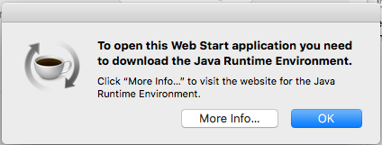

I know nothing about Java. One day, I needed to open the file with extension `jnlp` with Java Web Start to download a huge number of images. As far as I know, for a non-Java-developer like me, I just need to install Java Runtime Environment (JRE). It's not necessary to install Java Development Kit (JDK).

First I check my Java:
```
> java -version
java version "15.0.1" 2020-10-20
Java(TM) SE Runtime Environment (build 15.0.1+9-18)
Java HotSpot(TM) 64-Bit Server VM (build 15.0.1+9-18, mixed mode, sharing)
```

Ok, I saw something like JRE and was pretty sure that it will run. But when opening the file `jnlp`, I saw this error:


`jnlp` files are supposed to be open with `javaws` so I checked again if `javaws` existed in my computer:

```
> which javaws
/usr/bin/javaws
```

It was so weird, `javaws` also existed. Try again with `javaws`:
```
> javaws /path/to/file.jnlp
No Java runtime present, requesting install.
Unable to locate a Java Runtime to invoke.
```

I had JRE but `javaws` was unable to allocate it. After wondering around, I found one answer that `Java Web Start` was depreccated in Java 9 and removed in Java 11. ([this answer](https://stackoverflow.com/a/62943878/11524628)).

Therefore, a workaround for this is installing JRE-8. Download [here](https://www.oracle.com/java/technologies/javase-jre8-downloads.html#license-lightbox) or go to Oracle website to download the installer suitable for current OS: [oracle](https://www.oracle.com/java/technologies/javase-jre8-downloads.html)

And then install JRE-8, it will work as it supposes to be.

### Conclusion:
* When encountering this problem, just download JRE-8, it will be a solution.
* To check if JRE exists, use this command rather than `java -version`: `/Library/Internet\ Plug-Ins/JavaAppletPlugin.plugin/Contents/Home/bin/java -version`. If not exist, install JRE-8 or sooner version.