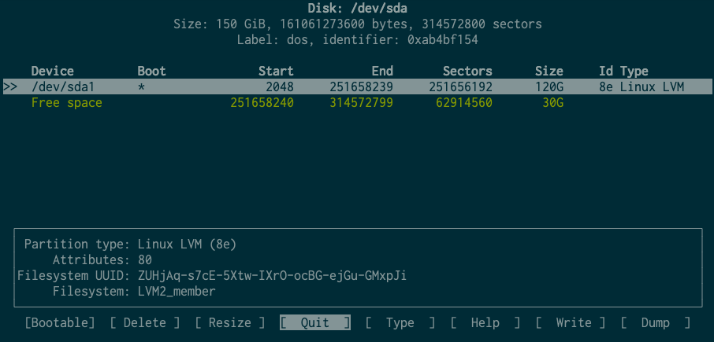

Virtual machine has a limited partition for `/`, `/root`, and `/tmp`. When building Singularity images, this error can occur:
`No space left on device`

There are two proposed ways to fix the problem:

### (1) Redirect temporary directory and disable cache when building image

using `--tmpdir` tag with absolute dir path to redirect temporary to use for `buid` (where there is more space) rather than the default `/tmp`. Additionally, caches also consume space, we can disable it by `--disable-cache`. ([ref](https://sylabs.io/guides/3.4/user-guide/cli/singularity_build.html))

### (2) Increase partition size for vagrant and vagrant-root.
* Install `vagrant-disksize` plugin
  
  `vagrant plugin install vagrant-disksize`

* Modify Vagrantfile to the size we expect (and of course in our capacity)

```
Vagrant.configure("2") do |config|
  config.vm.box = "sylabs/singularity-3.5-ubuntu-bionic64"
  config.disksize.size='150GB'
```
* `vagrant hault;vagrant up`

In case, it doesn't work. We can destroy the box in Virtual Box and re-create the box, then `vagrant up` ([ref](https://stackoverflow.com/a/51064467/11524628))

* `vagrant ssh` and then see the disk size with `df -h`:
```bash
Filesystem                    Size  Used Avail Use% Mounted on
udev                          1.9G     0  1.9G   0% /dev
tmpfs                         390M  548K  390M   1% /run
/dev/mapper/vagrant--vg-root   19G  7.5G   11G  43% /
tmpfs                         2.0G     0  2.0G   0% /dev/shm
tmpfs                         5.0M     0  5.0M   0% /run/lock
tmpfs                         2.0G     0  2.0G   0% /sys/fs/cgroup
vagrant                       1.9T   20G  1.8T   2% /vagrant
tmpfs                         390M     0  390M   0% /run/user/900
```
Here the vagrant-root is still 20GB. To change this size ([ref](https://stackoverflow.com/a/60185312/11524628)):
* `sudo cfdisk /dev/sda`
  
* use arrows to select your disk `/dev/sda[X]`
* Select `Resize`, enter the number you want, then select `write` --> `Quit`
* `sudo resize2fs -p -F /dev/sda[X]`
However, in my case `resize2fs` didn't work. Debug ([ref](https://unix.stackexchange.com/a/583544/395421)):
    * `sudo pvresize /dev/sda[X]` (resize the Physical Volume)
    * `sudo lvextend -r -l +100%FREE /dev/mapper/ubuntu--vg-root` (expand logical volume)

And here is the result:
```
vagrant@vagrant:/vagrant$ df -h
Filesystem                    Size  Used Avail Use% Mounted on
udev                          1.9G     0  1.9G   0% /dev
tmpfs                         390M  540K  390M   1% /run
/dev/mapper/vagrant--vg-root  118G  6.8G  106G   7% /
tmpfs                         2.0G     0  2.0G   0% /dev/shm
tmpfs                         5.0M     0  5.0M   0% /run/lock
tmpfs                         2.0G     0  2.0G   0% /sys/fs/cgroup
vagrant                       1.9T   45G  1.8T   3% /vagrant
tmpfs                         390M     0  390M   0% /run/user/900
```
